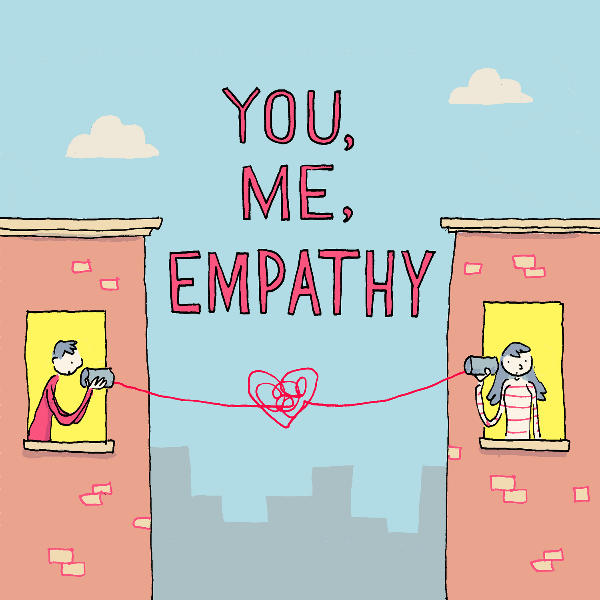

# Empathy
## Empathy Interview
The goal of the empathy interview was to gain a deep understanding of how the users felt and what they relly wanted. My partner (Josephine) and I came up with around 20 questions to ask our user group so we could learn what problems they had and wht they wanted to fix. Throughout the interview we took notes on a document to record what our users said, and felt. To really empathize with our users and understnad how they felt we put the notes from out interview into an empathy map.

  

## Empathy Mapping
My group's empathy map was made using the information from the interview. We created a chart based on what the users said, and how the felt as a result of what they said. Throught the empathy map we were able to synthesize the information from the interview and get a better idea of what the users wanted. 

## Demand
Through our interview, and empathy mapping, my group learned that our users wanted to stay focused and motivated, but they were having trouble. Specifically, they felt like they weren't motivated to exercise and got distracted while in school, or doing homework. This made them feel guilty because they knew that they needed to exercise and get work done, but they weren't able to. Through this, my partner and I learned that we needed to make something that would help our users stay focused and exercise, so they would have something to remind them to do what they need to do.