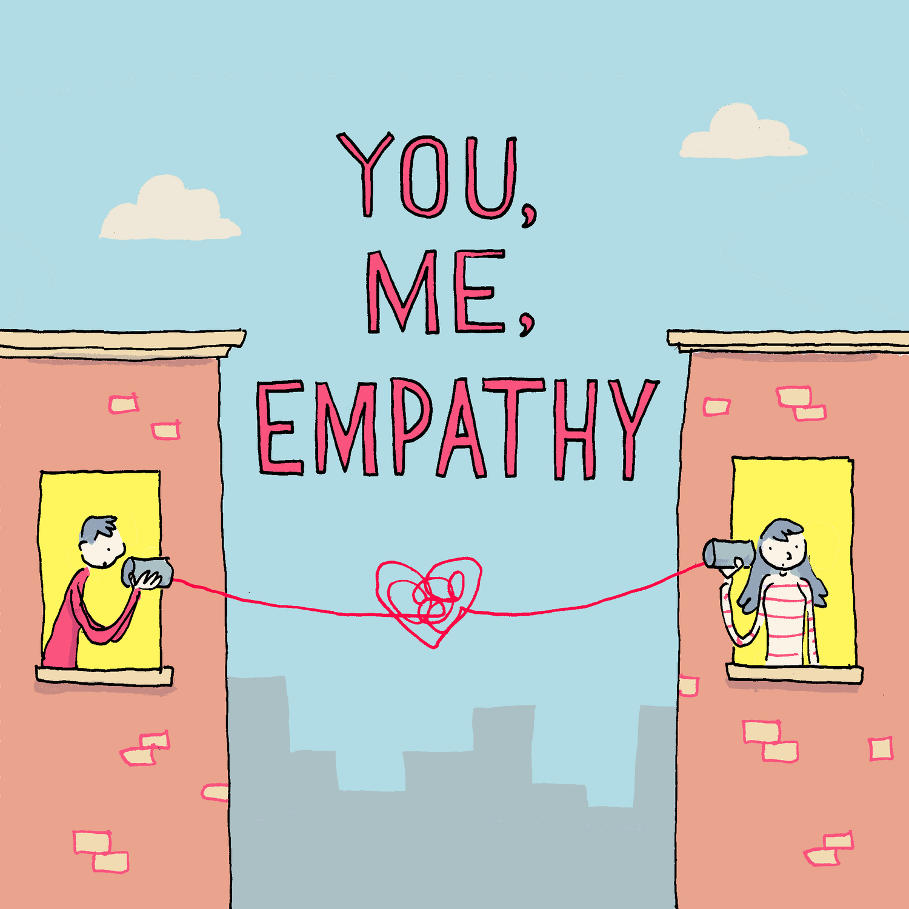
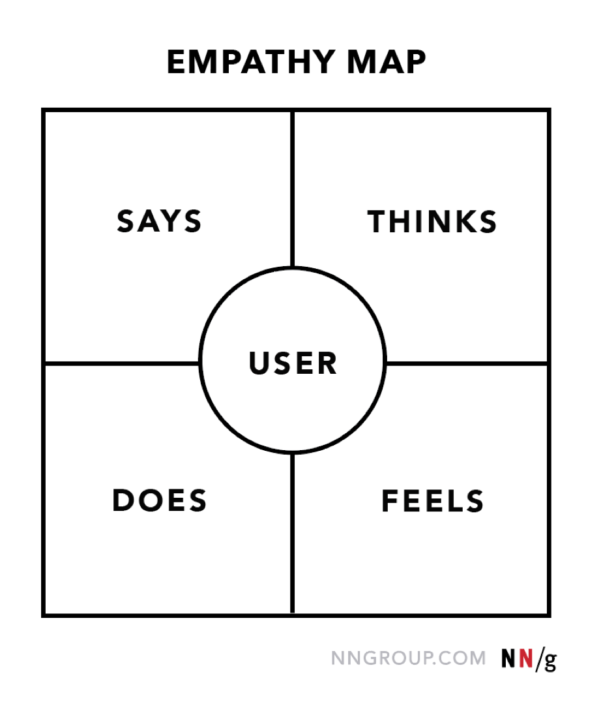
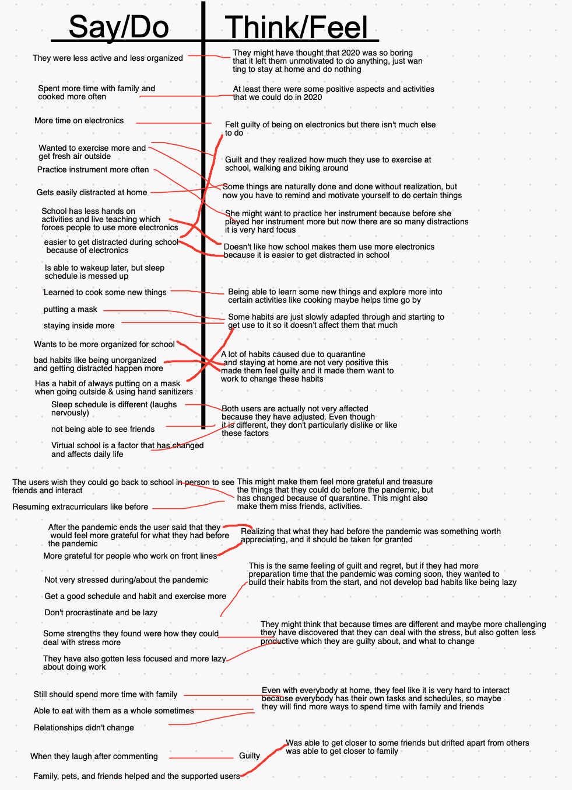

# LOX: 9th Grade IDE project

  

For the full presentation go to: https://docs.google.com/presentation/d/e/2PACX-1vQC-G_bO7TxGnpvw2YAJBVjNoPSlV91cOFHt0mkVWjMOMaaw_oAV_NwsgGkdubhFYvobEOrWpb5X_ue/pub?start=false&loop=false&delayms=3000
# Empathy
## Empathy Interview
The goal of the empathy interview was to gain a deep understanding of how the users felt and what they relly wanted. My partner (Josephine) and I came up with around 20 questions to ask our user group so we could learn what problems they had and wht they wanted to fix. Throughout the interview we took notes on a document to record what our users said, and felt. To really empathize with our users and understnad how they felt we put the notes from out interview into an empathy map.

  

## Empathy Mapping
My group's empathy map was made using the information from the interview. We created a chart based on what the users said, and how the felt as a result of what they said. Throught the empathy map we were able to synthesize the information from the interview and get a better idea of what the users wanted. 

  

## Demand
Through our interview, and empathy mapping, my group learned that our users wanted to stay focused and motivated, but they were having trouble. Specifically, they felt like they weren't motivated to exercise and got distracted while in school, or doing homework. This made them feel guilty because they knew that they needed to exercise and get work done, but they weren't able to. Through this, my partner and I learned that we needed to make something that would help our users stay focused and exercise, so they would have something to remind them to do what they need to do.

  

# Define
## The Problem
Our users felt like they weren't motivated and that they had trouble exercising and studying. This is an issue because not getting enough exericse can lead to many negetive factors. According to an article from Time Magazine, " In a sample of about 3,000 U.S. adults, people who were meeting exercise guidelines before the pandemic reported an average 32% reduction in physical activity once social-distancing measures went into effect.” The article shows that getting enough exercise is not just a problem for our users, it is a problem for the majority of people during the pandemic. Not getting enough exercise may not seem like such an important issue but, it can increase risk of heart disease risk factors type 2 diabetes, cancer, obesity, and more.(Centers for Disease Control and Prevention ). Another problem that our users had was not being able to study and focus in school due to being distracted by technology. According to the US National Library of Health, "Internet services have seen rises in usage from 40 % to 100 %, compared to pre-lockdown levels". Part of the reson internet services have increased is because of online learning, but internet services have also increased because people get more distracted by technology.According to the Derek Bok Center, Harvard University, "80% of students agreed that using a mobile phone in class decreases their ability to pay attention. " My group's goal is to help our users find a solution for being unmotivated. 

Due to the pandemic, many students at LAHS are struggling to stay motivated, whether it's being focused in school, or staying active. During the interview with our users, they said they were less motivated to work on things and got easily distracted by technology. They also mentioned that they were not able to exercise as much as they wanted. We would like to explore ways to help these students solve the problem of being easily distracted and unmotivated to exercise, so that they can not only feel guilt-free, but also become more productive in school and healthier in general. During online school there are a lot of distractions like technology in your workspace that can hinder them from focusing on schoolwork. This causes our users to avert their attention to their devices, which makes them struggle on tasks in class. In addition, students may also lose focus and not give their best effort while working on homework, which is inefficient and takes a long time. Furthermore, our users used to get sufficient amounts of exercise with school and extracurricular activities, but now they feel trapped in the house and too unmotivated to get some fresh air on their own. This is important  to our users because they want to change these bad habits and become more productive to improve academically. Additionally, by exercising more they can become healthier and energized. How might we create a way for our users to stay more motivated in school, and to get exercise?

## Summary of Reasearch
Through our research, my partner and I looked into the issue of being unmotivated to do work and exercise. We learned that it is extremely important to get exercise often, so being unmotivated to exercise can be unhealthy. We also learned that students are very dependent on technology and electronics, so they often get distracted by their phones and don't do thier work. This was one problem that our users wanted us to solve as well, so we conducted a survey with extreme users to get more information and data. Our research showed that students looked at their phones every 15 mintutes, and this could lead them to get distracted for a few minutes each time. It might not sound like much itme, but it all adds up, and students waste a lot of their time.

## Sources
https://www.heart.org/en/news/2020/04/09/most-of-the-nations-teens-arent-getting-enough-exercise

https://time.com/5831678/covid-19-americans-exercise/

https://www.nytimes.com/2020/10/07/well/move/pandemic-exercise-habits-study.html

https://www.cdc.gov/chronicdisease/resources/publications/factsheets/physical-activity.htm#:~:text=Not%20getting%20enough%20physical%20activity%20can%20lead%20to%20heart%20disease,cholesterol%2C%20and%20type%202%20diabetes

https://bokcenter.harvard.edu/technology-and-student-distraction

https://www.ncbi.nlm.nih.gov/pmc/articles/PMC7280123/

https://kappanonline.org/rosen-distracted-student-mind-attention/

https://www.health.harvard.edu/newsletter_article/why-we-should-exercise-and-why-we-dont

https://www.epi.org/blog/learning-during-a-pandemic-what-decreased-learning-time-in-school-means-for-student-learning/

https://www.nuvancehealth.org/coronavirus/exercise-is-essential-for-well-being-during-covid-19-pandemic/

https://www.oberlo.com/blog/motivational-quotes 

https://www.healthline.com/health/mental-health/motivation-work-tasks#2.-Make-lists-and-stick-to-them 

## Additional Research Method
My partner and I chose to do an extreme interview for our additional research. We conducted our interview by asking two different people the same set of questions. One person was someone who was focused and organized overall, and the other person was the exact opposite. By asking each of the people the same question, we learned what they did differently and how one person was able to stay focused and why the other person became distracted easily. Through the interview, we learned that one cause for distraction is when the user decides to take a break from working but then get carried away, and doesn't return to working again. Also, our focused user said that they are able to finish all their work without getting distracted because they put all of their devices away before working and they try to finish as much work as they can. Using the data gathered from out research we can start creating concept sketches for our users.

# Ideate
## Brainstorming
During this step, my partner and I worked on coming up with as many different ideas as we could think of. Using the information from our previous research and interviews, we tried to come up with solutions for specific problems that our users mentioned. Overall we came up with 10 ideas (five each) and we sketched them out. 

  

## Concept Sketches
During this step, my partner and I worked on coming up with as many different ideas as we could think of. Using the information from our previous research and interviews, we tried to come up with solutions for specific problems that our users mentioned. Overall we came up with 10 ideas (five each) and we sketched them out. We then, used a decision matrix to chose which solutions would work best.

  

## Rapide Prototyping
The first image is a box that locks your phone until the time runs out to help the user not get distracted. The second image is an exercise choser that is meant to help the user find a good exercise and motivate them to get outside. The lights on the CP would spin around and randomly end up on one of the numbers which correspond to a workout that the user can do. 

# Prototyping
## 1st Iteration Code
The code is meant to be used with the Arduino UNO board, servos, LCD display, and a joystick. The cod is meant to get input from the joystick and use that to change the amount of time that the user wants to set on their timer. The LCD display shows how much time the user is seeing and the display changes as the user increases the time or decreases the time. The timer starts when the user presses the bottom on the joystick and continues until the time runs out. The display continually shows how much time is left on the time and it also notifies the user when the time runs out. 

## Box Design
Before creating the illustrator design, I made a model of the box, so would know what pieces I would need to make. The tinkerCAD design is not accurate in measurements, but it is just to get an overall idea of what I want to make. The illustrator design is made up of the different pieces that will fit together to create a box that will hold the phone. The box automatically opens and closes with the servos that pull a piece of string. The string then is tied to the door and the door is pulled shut. The door functions kind of like a drawbridge, and it is controlled by the timer, so when the time runs out the door opens. Another important feature is the emergency stop button this is used if the user wants to open the door when the time hasn't run out yet, the button will stop the timer and open the door so the user can access their phone when they need it. 

  

## Final Project
Once the design was laser cut, I put it together using the different pieces. Then I also wired the joystick, LCD, and servos so they could all be connected to the Arduino at once. The box also contains a compartment at the top which is used for the Arduino and breadboard, and there is also a space at the top where the LCD display can be seen. 

## Next Steps
My partner and I were able to get some feedback from our users on what they wanted to include or remove in our next design. One idea that they liked was including a small space in the door so it is possible to insert a phone charger, so you can charge your phone while it is in the box. In our next Iteration, we will definitely include the charging space, and I also want to increase the space that is need for the Arduino and wiring because I feel like everything is currently crammed into a small space. Another improvement that I want to make is to create a better space to put the joystick and the LCD display because the sizing was not correct.

# Iterations
## Iteration #2:
## 2nd Iteration Code
 The code is meant to be used with the Arduino UNO board, servos, LCD display, and a joystick. The code from the second iterations is very similar to the code from the first iteration because we did not make major changes. The overall structure and function of the code are the same, the only difference is that there are some issues and errors that were in the previous code, and got fixed in this version of the code. This is mainly related to the way the timer worked because there were some issues with getting the timer to stop at the right time and making sure that no delays affected the timer. 

## Box Design
In our second Iteration design, we had many improved features that were added to solve the issues that we had in the previous design. First, we included pieces that would hold the LCD, joystick and CP board in place, so they were not loose or falling out. This allowed for better control and use of the joystick, and LCD. We also added the space in the door for a charger, so the users could charge their phone while inside the box.
